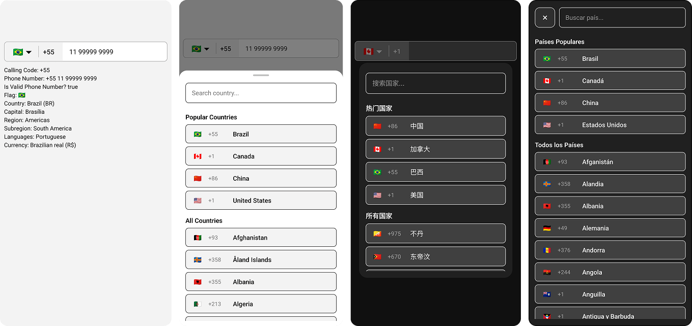
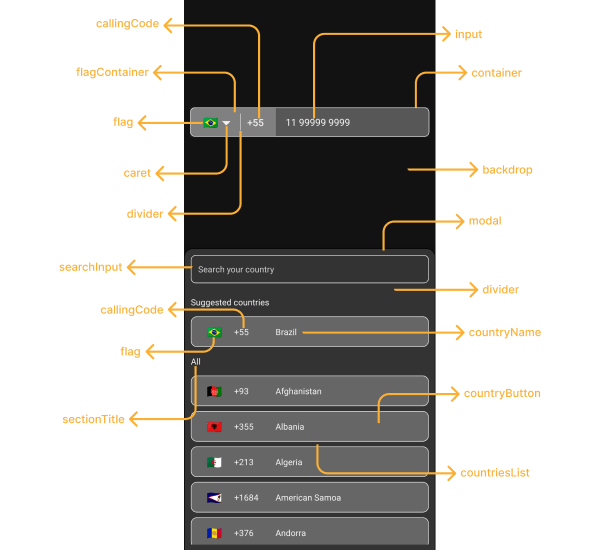

<br>

<div align = "center">
  
</div>

<br>

<h1 align="center">React Native International Phone Number Input</h1>

<p align="center">
  <a href="https://www.npmjs.com/package/react-native-international-phone-number">
    
  </a>
  <a href="https://www.npmjs.com/package/react-native-international-phone-number">
    
  </a>
  <a href="https://github.com/AstrOOnauta/react-native-international-phone-number">
    
  </a>
  <a href="https://github.com/AstrOOnauta/react-native-international-phone-number/issues">
    
  </a>
  <a href="https://github.com/AstrOOnauta/react-native-international-phone-number/pulls">
    
  </a>
  <a href="LICENSE.md">
    
  </a>
</p>

<br>

<div align = "center">
    <a href="https://www.buymeacoffee.com/astroonauta" target="_blank">
        
    </a>
</div>

## Try it out

- [Demo](https://snack.expo.dev/@astroonauta/react-native-international-phone-number)

## List of Contents

- [Old Versions](#old-versions)
- [Installation](#installation)
- [Additional Config to Web](#additional-config-to-web)
- [Features](#features)
- [Basic Usage](#basic-usage)
  - [With Class Component](#class-component)
  - [With Function Component](#function-component)
  - [With Typescript](#typescript)
- [Intermediate Usage](#intermediate-usage)
  - [Typescript + useRef](#typescript--useref)
- [Advanced Usage](#advanced-usage)
  - [React-Hook-Form + Typescript + Default Phone Number Value](#react-hook-form--typescript--default-phone-number-value)
- [Customizing Lib](#customizing-lib)
  - [Dark Mode](#dark-mode)
  - [Custom Lib Styles](#custom-lib-styles)
  - [Custom Caret](#custom-caret)
  - [Custom Placeholders/Messages](#custom-placeholdersmessages)
  - [Custom Modal Height](#custom-modal-height)
  - [Country Modal Disabled Mode](#country-modal-disabled-mode)
  - [Phone Input Disabled Mode](#phone-input-disabled-mode)
  - [Custom Disabled Mode Style](#custom-disabled-mode-style)
  - [Change Default Language](#change-default-language)
  - [Custom Phone Mask](#custom-phone-mask)
  - [Custom Default Flag/Country](#custom-default-flagcountry)
  - [Default Phone Number Value](#default-phone-number-value)
  - [Show Only Some Countries Inside Modal](#show-only-some-countries)
  - [Exclude some countries Inside Modal](#exclude-some-countries)
  - [Show Popular Countries at the Top of the Countries List Inside Modal](#show-popular-countries-at-the-top-of-the-countries-list-inside-modal)
- [Lib Props](#component-props-phoneinputprops)
- [Lib Functions](#functions)
- [Supported languages](#🎌-supported-languages-🎌)
- [Contributing](#contributing)
- [License](#license)

<br>

## Old Versions

- [Version 0.6.x](https://github.com/AstrOOnauta/react-native-international-phone-number/tree/v0.6.x)
- [Version 0.5.x](https://github.com/AstrOOnauta/react-native-international-phone-number/tree/v0.5.x)
- [Version 0.4.x](https://github.com/AstrOOnauta/react-native-international-phone-number/tree/v0.4.x)

<br>

## Installation

```bash
$ npm i --save react-native-international-phone-number
```

OR

```bash
$ yarn add react-native-international-phone-number
```

## Additional config to `Web`

- Using React Native CLI:

create a `react-native.config.js` file at the root of your react-native project with:

```bash
 module.exports = {
  project: {
    ios: {},
    android: {},
  },
  assets: [
    './node_modules/react-native-international-phone-number/lib/assets/fonts',
  ],
 };
```

Then link the font to your native projects with:

```bash
npx react-native-asset
```

- Using Expo:

1. Install [expo-fonts](https://docs.expo.dev/versions/latest/sdk/font/): `npx expo install expo-font`;
2. Initialize the `expo-font`:

```bash
 import { useFonts } from 'expo-font';

 ...

 useFonts({
    'TwemojiMozilla': require('./node_modules/react-native-international-phone-number/lib/assets/fonts/TwemojiMozilla.woff2'),
  });

 ...
```

> Observation: _you need to recompile your project after adding new fonts._

<br>

## Features

- 📱 Works with iOS, Android (Cross-platform), Expo and Web;
- 🎨 Lib with UI customizable;
- 🌎 Phone Input Mask according with the selected country;
- 👨‍💻 Functional and class component support;
- 🈶 21 languages supported.

<br>

## Basic Usage

- ### Class Component:

```jsx
import React from 'react';
import { View, Text } from 'react-native';
import PhoneInput from 'react-native-international-phone-number';

export class App extends React.Component {
  constructor(props) {
    super(props)
    this.state = {
      selectedCountry: null,
      inputValue: ''
    }
  }

  function handleSelectedCountry(country) {
    this.setState({
      selectedCountry: country
    })
  }

  function handleInputValue(phoneNumber) {
    this.setState({
      inputValue: phoneNumber
    })
  }

  render(){
    return (
      <View style={{ width: '100%', flex: 1, padding: 24 }}>
        <PhoneInput
          value={this.state.inputValue}
          onChangePhoneNumber={this.handleInputValue}
          selectedCountry={this.state.selectedCountry}
          onChangeSelectedCountry={this.handleSelectedCountry}
        />
        <View style={{ marginTop: 10 }}>
          <Text>
            Country:{' '}
            {`${this.state.selectedCountry?.name?.en} (${this.state.selectedCountry?.cca2})`}
          </Text>
          <Text>
            Phone Number: {`${this.state.selectedCountry?.callingCode} ${this.state.inputValue}`}
          </Text>
        </View>
      </View>
    );
  }
}
```

- ### Function Component:

```jsx
import React, { useState } from 'react';
import { View, Text } from 'react-native';
import PhoneInput from 'react-native-international-phone-number';

export default function App() {
  const [selectedCountry, setSelectedCountry] = useState(null);
  const [inputValue, setInputValue] = useState('');

  function handleInputValue(phoneNumber) {
    setInputValue(phoneNumber);
  }

  function handleSelectedCountry(country) {
    setSelectedCountry(country);
  }

  return (
    <View style={{ width: '100%', flex: 1, padding: 24 }}>
      <PhoneInput
        value={inputValue}
        onChangePhoneNumber={handleInputValue}
        selectedCountry={selectedCountry}
        onChangeSelectedCountry={handleSelectedCountry}
      />
      <View style={{ marginTop: 10 }}>
        <Text>
          Country:{' '}
          {`${selectedCountry?.name?.en} (${selectedCountry?.cca2})`}
        </Text>
        <Text>
          Phone Number:{' '}
          {`${selectedCountry?.callingCode} ${inputValue}`}
        </Text>
      </View>
    </View>
  );
}
```

- ### Typescript

```tsx
import React, { useState } from 'react';
import { View, Text } from 'react-native';
import PhoneInput, {
  ICountry,
} from 'react-native-international-phone-number';

export default function App() {
  const [selectedCountry, setSelectedCountry] =
    useState<null | ICountry>(null);
  const [inputValue, setInputValue] = useState<string>('');

  function handleInputValue(phoneNumber: string) {
    setInputValue(phoneNumber);
  }

  function handleSelectedCountry(country: ICountry) {
    setSelectedCountry(country);
  }

  return (
    <View style={{ width: '100%', flex: 1, padding: 24 }}>
      <PhoneInput
        value={inputValue}
        onChangePhoneNumber={handleInputValue}
        selectedCountry={selectedCountry}
        onChangeSelectedCountry={handleSelectedCountry}
      />
      <View style={{ marginTop: 10 }}>
        <Text>
          Country:{' '}
          {`${selectedCountry?.name?.en} (${selectedCountry?.cca2})`}
        </Text>
        <Text>
          Phone Number:{' '}
          {`${selectedCountry?.callingCode} ${inputValue}`}
        </Text>
      </View>
    </View>
  );
}
```

<br>

## Intermediate Usage

- ### Typescript + useRef

```tsx
import React, { useRef } from 'react';
import { View, Text } from 'react-native';
import PhoneInput, {
  ICountry,
  IPhoneInputRef,
} from 'react-native-international-phone-number';

export default function App() {
  const phoneInputRef = useRef<IPhoneInputRef>(null);

  function onSubmitRef() {
    Alert.alert(
      'Intermediate Result',
      `${phoneInputRef.current?.selectedCountry?.callingCode} ${phoneInputRef.current?.value}`
    );
  }

  return (
    <View style={{ width: '100%', flex: 1, padding: 24 }}>
      <PhoneInput ref={phoneInputRef} />
      <TouchableOpacity
        style={{
          width: '100%',
          paddingVertical: 12,
          backgroundColor: '#2196F3',
          borderRadius: 4,
          marginTop: 10,
        }}
        onPress={onSubmit}
      >
        <Text
          style={{
            color: '#F3F3F3',
            textAlign: 'center',
            fontSize: 16,
            fontWeight: 'bold',
          }}
        >
          Submit
        </Text>
      </TouchableOpacity>
    </View>
  );
}
```

> Observation: Don't use the useRef hook combined with the useState hook to manage the phoneNumber and selectedCountry values. Instead, choose to use just one of them (useRef or useState).

<br>

## Advanced Usage

- ### React-Hook-Form + Typescript + Default Phone Number Value

```tsx
import React, { useState, useEffect } from 'react';
import { View, Text, TouchableOpacity, Alert } from 'react-native';
import PhoneInput, {
  ICountry,
} from 'react-native-international-phone-number';
import { Controller, FieldValues } from 'react-hook-form';

interface FormProps extends FieldValues {
  phoneNumber: string;
}

export default function App() {
  const [selectedCountry, setSelectedCountry] = useState<
    undefined | ICountry
  >(undefined);

  function handleSelectedCountry(country: ICountry) {
    setSelectedCountry(country);
  }

  function onSubmit(form: FormProps) {
    Alert.alert(
      'Advanced Result',
      `${selectedCountry?.callingCode} ${form.phoneNumber}`
    );
  }

  return (
    <View style={{ width: '100%', flex: 1, padding: 24 }}>
      <Controller
        name="phoneNumber"
        control={control}
        render={({ field: { onChange, value } }) => (
          <PhoneInput
            defaultValue="+12505550199"
            value={value}
            onChangePhoneNumber={onChange}
            selectedCountry={selectedCountry}
            onChangeSelectedCountry={handleSelectedCountry}
          />
        )}
      />
      <TouchableOpacity
        style={{
          width: '100%',
          paddingVertical: 12,
          backgroundColor: '#2196F3',
          borderRadius: 4,
        }}
        onPress={handleSubmit(onSubmit)}
      >
        <Text
          style={{
            color: '#F3F3F3',
            textAlign: 'center',
            fontSize: 16,
            fontWeight: 'bold',
          }}
        >
          Submit
        </Text>
      </TouchableOpacity>
    </View>
  );
}
```

> Observations:
>
> 1. You need to use a default value with the following format: `+(country callling code)(area code)(number phone)`
> 2. The lib has the mechanism to set the flag and mask of the supplied `defaultValue`. However, if the supplied `defaultValue` does not match any international standard, the `input mask of the defaultValue` will be set to "BR" (please make sure that the default value is in the format mentioned above).

<br>

## Customizing lib



- ### Dark Mode:

```jsx
  ...
  <PhoneInput
    ...
    theme="dark"
  />
  ...
```

- ### Custom Lib Styles:

```jsx
  ...
  <PhoneInput
    ...
    phoneInputStyles={{
      container: {
        backgroundColor: '#575757',
        borderWidth: 1,
        borderStyle: 'solid',
        borderColor: '#F3F3F3',
      },
      flagContainer: {
        borderTopLeftRadius: 7,
        borderBottomLeftRadius: 7,
        backgroundColor: '#808080',
        justifyContent: 'center',
      },
      flag: {},
      caret: {
        color: '#F3F3F3',
        fontSize: 16,
      },
      divider: {
        backgroundColor: '#F3F3F3',
      }
      callingCode: {
        fontSize: 16,
        fontWeight: 'bold',
        color: '#F3F3F3',
      },
      input: {
        color: '#F3F3F3',
      },
    }}
    modalStyles={{
      modal: {
        backgroundColor: '#333333',
        borderWidth: 1,
      },
      backdrop: {},
      divider: {
        backgroundColor: 'transparent',
      },
      countriesList: {},
      searchInput: {
        borderRadius: 8,
        borderWidth: 1,
        borderColor: '#F3F3F3',
        color: '#F3F3F3',
        backgroundColor: '#333333',
        paddingHorizontal: 12,
        height: 46,
      },
      countryButton: {
        borderWidth: 1,
        borderColor: '#F3F3F3',
        backgroundColor: '#666666',
        marginVertical: 4,
        paddingVertical: 0,
      },
      noCountryText: {},
      noCountryContainer: {},
      flag: {
        color: '#FFFFFF',
        fontSize: 20,
      },
      callingCode: {
        color: '#F3F3F3',
      },
      countryName: {
        color: '#F3F3F3',
      },
    }}
  />
  ...
```

- ### Custom Caret:

```jsx
  ...
  <PhoneInput
    ...
    customCaret={<Icon name="chevron-down" size={30} color="#000000" />}  // react-native-vector-icons
  />
  ...
```

- ### Custom Placeholders/Messages:

```jsx
  ...
  <PhoneInput
    ...
    placeholder="Custom Phone Input Placeholder"
    modalSearchInputPlaceholder="Custom Modal Search Input Placeholder"
    modalNotFoundCountryMessage="Custom Modal Not Found Country Message"
  />
  ...
```

- ### Custom Modal Height:

```jsx
  ...
  <PhoneInput
    ...
    modalHeight="80%"
  />
  ...
```

- ### Country Modal Disabled Mode:

```jsx
  ...
  <PhoneInput
    ...
    modalDisabled
  />
  ...
```

- ### Phone Input Disabled Mode:

```jsx
  ...
  <PhoneInput
    ...
    disabled
  />
  ...
```

- ### Custom Disabled Mode Style:

```jsx
  const [isDisabled, setIsDisabled] = useState<boolean>(true)
  ...
  <PhoneInput
    ...
    containerStyle={ isDisabled ? { backgroundColor: 'yellow' } : {} }
    disabled={isDisabled}
  />
  ...
```

- ### Change Default Language:

```jsx
  ...
  <PhoneInput
    ...
    language="pt"
  />
  ...
```

- ### Custom Phone Mask:

```jsx
  ...
  <PhoneInput
    ...
    customMask={['#### ####', '##### ####']}
  />
  ...
```

- ### Custom Default Flag/Country:

```jsx
  ...
  <PhoneInput
    ...
    defaultCountry="CA"
  />
  ...
```

- ### Default Phone Number Value:

```jsx
  ...
  <PhoneInput
    ...
    defaultValue="+12505550199"
  />
  ...
```

> Observations:
>
> 1. You need to use a default value with the [e164](https://en.wikipedia.org/wiki/E.164) format: `+(country callling code)(area code)(number phone)`
> 2. The lib has the mechanism to set the flag and mask of the supplied `defaultValue`. However, if the supplied `defaultValue` does not match any international standard, the `input mask of the defaultValue` will be set to "BR" (please make sure that the default value is in the format mentioned above).

- ### Show Only Some Countries Inside Modal:

```jsx
  ...
  <PhoneInput
    ...
    showOnly={['BR', 'PT', 'CA', 'US']}
  />
  ...
```

- ### Exclude Some Countries Inside Modal:

```jsx
  ...
  <PhoneInput
    ...
    excludedCountries={['BR', 'PT', 'CA', 'US']}
  />
  ...
```

- ### Show Popular Countries at the Top of the Countries List Inside Modal:

```jsx
  ...
  <PhoneInput
    ...
    popularCountriess={['BR', 'PT', 'CA', 'US']}
  />
  ...
```

</br>

## Component Props ([PhoneInputProps](lib/interfaces/phoneInputProps.ts))

- `language?:` [ILanguage](lib/interfaces/language.ts);
- `customMask?:` string[];
- `defaultValue?:` string;
- `value?:` string;
- `onChangePhoneNumber?:` (phoneNumber: string) => void;
- `defaultCountry?:` [ICountryCca2](lib/interfaces/countryCca2.ts);
- `selectedCountry?:` [ICountry](lib/interfaces/country.ts);
- `onChangeSelectedCountry?:` (country: [ICountry](lib/interfaces/country.ts)) => void;
- `showOnly?:` [ICountryCca2[]](lib/interfaces/countryCca2.ts);
- `excludedCountries?:` [ICountryCca2[]](lib/interfaces/countryCca2.ts);
- `popularCountries?:` [ICountryCca2[]](lib/interfaces/countryCca2.ts);
- `disabled?:` boolean;
- `modalDisabled?:` boolean;
- `modalHeight?:` number | string;
- `theme?:` [ITheme](lib/interfaces/theme.ts);
- `phoneInputStyles?:` [IPhoneInputStyles](lib/interfaces/phoneInputStyles.ts);
- `modalStyles?:` [IModalStyles](lib/interfaces/modalStyles.ts);
- `modalSearchInputPlaceholder?:` string;
- `modalSearchInputPlaceholderTextColor?:` string;
- `modalSearchInputSelectionColor?:` string;
- `modalNotFoundCountryMessage?:` string;
- `customCaret?:` [ReactNode](https://reactnative.dev/docs/react-node);
- `ref?:` [Ref](https://github.com/DefinitelyTyped/DefinitelyTyped/blob/663f439d11d78b65f1dfd38d120f3728ea2cc207/types/react/index.d.ts#L100)<[IPhoneInputRef](lib/interfaces/phoneInputRef.ts)>

<br>

## Functions

- `getAllCountries:` () => [ICountry](lib/interfaces/country.ts)[];
- `getCountriesByCallingCode:` (callingCode: string) => [ICountry](lib/interfaces/country.ts)[] | undefined;
- `getCountryByCca2:` (cca2: string) => [ICountry](lib/interfaces/country.ts) | undefined;
- `getCountriesByName:` (name: string, language: [ILanguage](lib/interfaces/language.ts)) => [ICountry](lib/interfaces/country.ts)[] | undefined;
- `getCountryByPhoneNumber:` (phoneNumber: string) => [ICountry](lib/interfaces/country.ts) | undefined;

</br>

## 🎌 Supported languages 🎌

```js
  "name": {
    "bg": "Bulgarian",
    "by": "Belarusian",
    "cn": "Chinese",
    "cz": "Czech",
    "de": "German",
    "ee": "Estonian",
    "el": "Greek",
    "en": "English",
    "es": "Espanol",
    "fr": "French",
    "he": "Hebrew",
    "it": "Italian",
    "jp": "Japanese",
    "nl": "Dutch",
    "pl": "Polish",
    "pt": "Portuguese",
    "ro": "Romanian",
    "ru": "Russian",
    "ua": "Ukrainian",
    "zh": "Chinese (Simplified)",
    "ar": "Arabic"
  },
```

<br>

## Contributing

- Fork or clone this repository

```bash
  $ git clone https://github.com/AstrOOnauta/react-native-international-phone-number.git
```

- Repair, Update and Enjoy 🛠️🚧⚙️

- Create a new PR to this repository

<br>

## License

[ISC](LICENSE.md)

<br>

<div align = "center">
	<br>
	  Thanks for stopping by! 😁
	<br>
</div>
